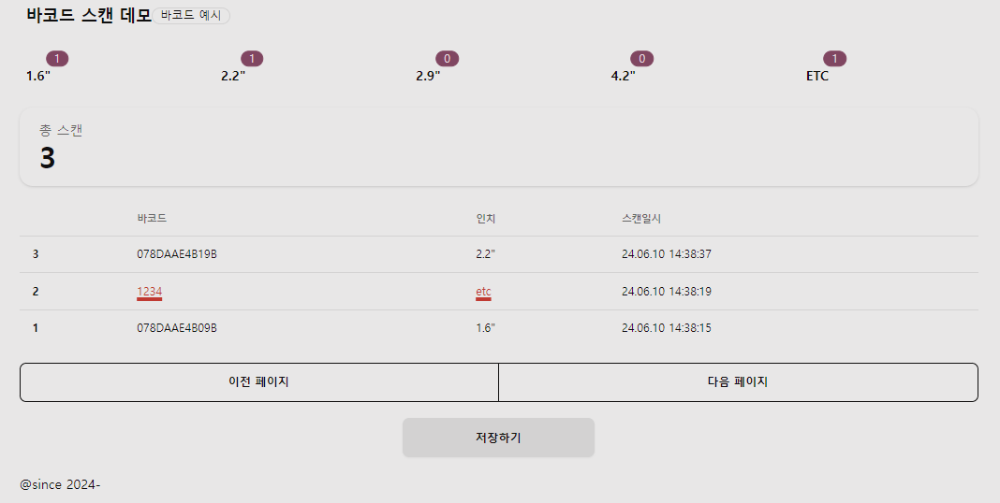

# README

## BARCODE 스캔 데모

BARCODE READER 를 사용하여 BARCODE 를 스캔 하면, 해당 정보가 화면에 표시 됩니다. 재고 실사등에 유용하게 사용하실 수 있습니다.

## 설치 및 실행

1. vscode `Live Server` plugin 설치 후 우측 하단 `Go Live` 클릭
2. `http://localhost:5500` 으로 접속
3. 바코드 스캐너를 연결 후 스캔

## 바코드 분류

- 뒷 4자리 기준으로 분류됨 (?는 임의 단어)
- B09? : 1.6" 태그
- B19? : 2.2" 태그
- B29? : 2.9" 태그
- B69? : 4.9" 태그

## 바코드 샘플

- `http://localhost:5500/barcode.html` 으로 접속 후 예제 샘플을 확인 할 수 있습니다.
- 또는 `JsBarcode` 라이브러리를 사용하여 바코드를 생성 할 수 있습니다.

